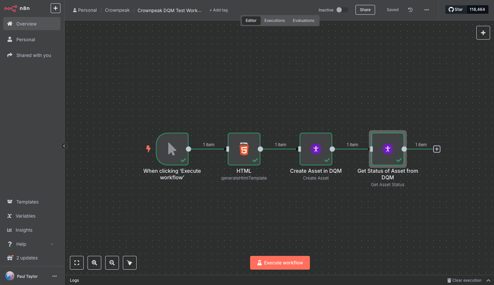
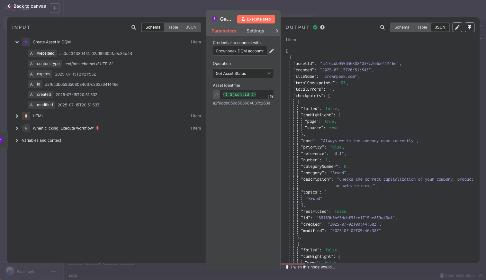

<a href="http://www.crownpeak.com" target="_blank">
  
</a>

# n8n-nodes-crownpeak-dqm

## Overview
This repository provides a custom **n8n integration node** for the [Crownpeak DQM CMS API](https://developer.crownpeak.com/DQM/cms/index.html). It enables direct access to asset operations such as creation, retrieval, and spellcheck quality analysis within an n8n workflow.

## What is it?
An n8n node module designed to simplify integration with Crownpeak DQM's CMS API using secure and structured credential management. It supports:

- Listing assets
- Checking asset processing status
- Fetching spellcheck issues
- Creating new assets
- Updating existing assets

## What is it for?
This module is useful for organizations using Crownpeak DQM who want to:

- Automate quality checks on web content
- Schedule or trigger DQM scans from CMS or DAM systems
- Include DQM analysis within broader content approval workflows

---

## Installation & Usage

### As a Private Node

1. Clone this repository to your local machine:

```bash
git clone https://github.com/crownpeak/n8n-nodes-crownpeak-dqm.git
```

2. Build the node module:

```bash
cd n8n-nodes-crownpeak-dqm
npm install
npm run build
```

3. Copy the `dist/` folder to your n8n instance's custom nodes directory:

```bash
docker cp ./dist n8n-dev:/home/node/.n8n/custom-nodes/crownpeak-dqm
```

4. Restart your n8n Docker container:

```bash
docker restart n8n-dev
```

5. Log in to n8n and the node will appear as **Crownpeak DQM**.

> ℹ️ If it doesn't appear, ensure you are mounting or copying to the correct container path and that `NODE_FUNCTION_ALLOW_EXTERNAL` is not overly restricted.

---

### As a Community Node (once approved)

Once this node is approved and published on the official [n8n integrations registry](https://n8n.io/integrations), installation will be as simple as:

```bash
n8n install n8n-nodes-crownpeak-dqm
```

And in `n8n@1.100.0+` via the UI:

1. Open **Settings → Community Nodes**
2. Click **Install a Community Node**
3. Search or paste: `n8n-nodes-crownpeak-dqm`
4. Click **Install**

> Community node versions are verified by n8n and automatically updated when new releases are published.

---

## Node Features

| Operation              | Method | Route                                       |
|------------------------|--------|---------------------------------------------|
| List Assets            | GET    | `/assets?apiKey=...&websiteId=...`         |
| Get Asset Status       | GET    | `/assets/:assetId/status`                  |
| Get Spellcheck Issues  | GET    | `/assets/:assetId/spellcheck`              |
| Create Asset           | POST   | `/assets`                                  |
| Update Asset           | PUT    | `/assets`                                  |

Each method supports query parameterization using dynamic expressions and securely authenticates using an API key.

---

## 📸 Screenshots
1. A basic workflow example using n8n Crownpeak DQM Node
   

2. The result of /spellcheck for a specified asset
   

---

## Support

- This repository is maintained by Crownpeak and released under the MIT License.
- For Crownpeak platform questions, please contact your Customer Success Manager or [support@crownpeak.com](mailto:support@crownpeak.com).
- For n8n integration issues or pull requests, use GitHub Issues or Discussions.

---

## License

MIT © Crownpeak Technology, Inc.  
See [LICENSE](./LICENSE) for details.